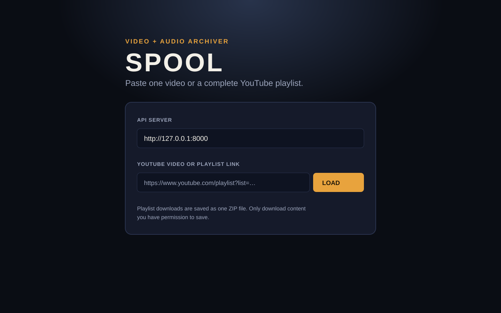
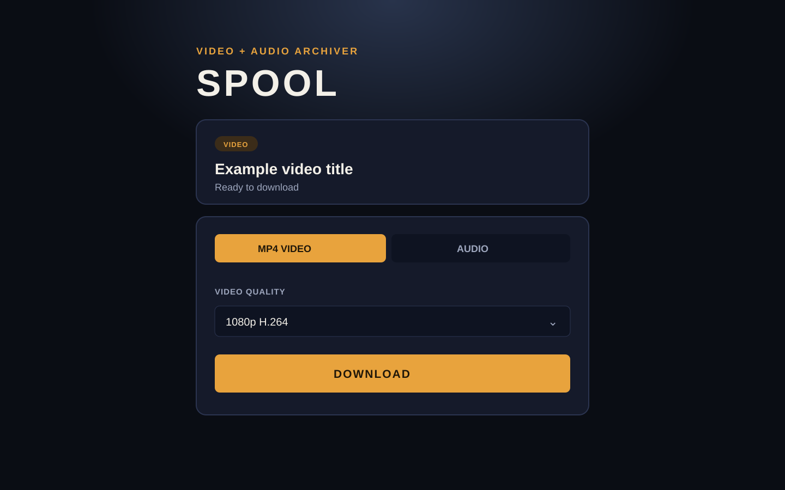

# Downloby

Downloby is a local YouTube video and audio downloader. It pairs a simple browser interface, **SPOOL**, with a FastAPI backend powered by `yt-dlp` and FFmpeg.

> **Use responsibly.** Only download material you own or are permitted to save. You are responsible for complying with YouTube's Terms of Service and applicable copyright law.

## What it can do

- Download a video as an MP4 file.
- Choose a specific available video stream, resolution, or codec.
- Extract audio as MP3, M4A, Opus, WAV, FLAC, or Vorbis.
- Choose an audio bitrate for lossy output formats.
- Inspect the streams available for a video before downloading.
- Download a playlist as a single ZIP archive.
- Use the SPOOL interface or call the REST API directly.

## Screenshots

The GUI screenshots live in [`docs/screenshots/`](docs/screenshots/).

### Start screen



### Download options



## Requirements

- Python **3.10 or newer**
- [FFmpeg](https://ffmpeg.org/download.html), available on your system `PATH`
- Internet access when loading or downloading YouTube content

Check that the prerequisites are available:

```powershell
python --version
ffmpeg -version
```

## Setup

### Windows (PowerShell)

From the project folder:

```powershell
python -m venv .venv
.\.venv\Scripts\Activate.ps1
python -m pip install --upgrade pip
python -m pip install -r .\v2\requirements.txt
```

If PowerShell prevents virtual-environment activation, run this once for the current terminal and try again:

```powershell
Set-ExecutionPolicy -Scope Process -ExecutionPolicy Bypass
```

Install FFmpeg if it is not already available. For example, with [Chocolatey](https://chocolatey.org/):

```powershell
choco install ffmpeg
```

Close and reopen the terminal after installing FFmpeg, then confirm `ffmpeg -version` works.

### macOS / Linux

```bash
python3 -m venv .venv
source .venv/bin/activate
python -m pip install --upgrade pip
python -m pip install -r v2/requirements.txt
```

Install FFmpeg with your package manager:

```bash
# macOS (Homebrew)
brew install ffmpeg

# Ubuntu / Debian
sudo apt update && sudo apt install ffmpeg
```

## Run the app

1. Activate the virtual environment if it is not already active.
2. Start the backend from the repository root:

   ```powershell
   .\.venv\Scripts\python.exe -m uvicorn app:app --app-dir .\v2 --host 127.0.0.1 --port 8000
   ```

   On macOS/Linux, use:

   ```bash
   .venv/bin/python -m uvicorn app:app --app-dir ./v2 --host 127.0.0.1 --port 8000
   ```

3. Keep that terminal running.
4. Open [`frontend/spool.html`](frontend/spool.html) in a web browser.
5. Confirm that **API server** is set to `http://127.0.0.1:8000`.

The API documentation is available at [http://127.0.0.1:8000/docs](http://127.0.0.1:8000/docs) while the server is running.

### Windows convenience launcher

[`Launch.py`](Launch.py) can start the API and open SPOOL, but its `BASE_DIR` setting is currently machine-specific. For a fresh clone, use the commands above or change `BASE_DIR` to your local project path before running:

```powershell
.\.venv\Scripts\python.exe .\Launch.py
```

## Using SPOOL

1. Start the backend and open `frontend/spool.html`.
2. Paste a YouTube video or playlist link.
3. Select **LOAD** to fetch the available formats.
4. For video, select an MP4 quality. For audio, switch to **AUDIO**, then choose the file format and bitrate.
5. Select **DOWNLOAD** and allow the browser download when prompted.

For playlists, the result is a ZIP file. Single-video downloads return the selected MP4 or audio file.

## API reference

| Endpoint | Purpose |
| --- | --- |
| `GET /formats?url=…` | Returns metadata and all available video/audio streams. |
| `GET /download/mp4?url=…` | Downloads MP4; optionally set `height`, `codec`, or `format_id`. |
| `GET /download/audio?url=…` | Extracts audio; accepts `audio_format`, `bitrate`, and optional `format_id`. |
| `GET /download/mp3?url=…` | Backwards-compatible MP3 shortcut. |
| `GET /download/playlist?url=…` | Downloads a playlist and returns a ZIP archive. |

Examples:

```text
GET /download/mp4?url=https://www.youtube.com/watch?v=VIDEO_ID&height=1080
GET /download/mp4?url=https://www.youtube.com/watch?v=VIDEO_ID&format_id=399
GET /download/audio?url=https://www.youtube.com/watch?v=VIDEO_ID&audio_format=mp3&bitrate=192
GET /download/playlist?url=https://www.youtube.com/playlist?list=PLAYLIST_ID&media_type=audio&audio_format=flac
```

### Supported audio formats

| Format | Notes |
| --- | --- |
| MP3 | Widely compatible lossy audio. |
| M4A | AAC audio in an M4A container. |
| Opus | Efficient modern lossy audio. |
| WAV | Uncompressed audio; larger files. |
| FLAC | Lossless compressed audio. |
| Vorbis | Ogg Vorbis audio. |

## Project layout

```text
docs/screenshots/       GUI screenshots used in this README
frontend/spool.html     SPOOL browser interface
frontend/spool.css      SPOOL styles
frontend/spool.js       SPOOL behaviour and API calls
v2/app.py               FastAPI routes
v2/downloader.py        yt-dlp and FFmpeg download logic
v2/requirements.txt     Python dependencies
v2/downloads/           Temporary prepared downloads
Launch.py               Optional Windows convenience launcher
```

## Troubleshooting

| Problem | What to check |
| --- | --- |
| `ffmpeg` is not recognized | Install FFmpeg, reopen the terminal, and ensure its `bin` directory is on `PATH`. |
| SPOOL says it cannot load a link | Make sure the backend terminal is still running and the API server field is `http://127.0.0.1:8000`. |
| Download fails while processing | Confirm the URL is valid and public, retry later, and make sure FFmpeg is installed. |
| Port 8000 is already in use | Stop the other process using the port or start Uvicorn with another port and update SPOOL's API server field. |
| High-quality video takes a while | 4K/8K video often requires separate video and audio streams that FFmpeg merges before the download begins. |

## Notes

- Files are prepared in `v2/downloads/` before being served to the browser.
- The project needs FFmpeg to merge separate video/audio streams and to convert audio formats.
- Do not commit downloaded media unless you have the right to distribute it.
